# Grupo N.º 2  
## Trabajo Grupal 3  
 ### Integrantes:
 - Héctor Ramos Vera 
 - David Sebastian Leon Guaman
 - Polk Brando Vernaza Quiñonez
 
### Análisis de Datos: Monitoreo de Pacientes en UCI y Predicción de Mortalidad (15 000 registros)
- El propósito de este conjunto de datos, centrado en el Análisis de Datos: Monitoreo de Pacientes en UCI y Predicción de Mortalidad, es proporcionar una base sólida para mejorar la toma de decisiones críticas en entornos hospitalarios mediante el uso de inteligencia de datos

# 1. Descripción del Propósito del Dataset

Con el objetivo de **orientar el análisis de datos de manera práctica** hacia un área de interés común para los tres integrantes del grupo, se decidió de forma unánime enfocar el proyecto en el **sector salud**.

El propósito principal del análisis es:

- Implementar **automatizaciones** y **algoritmos predictivos**.
- Mejorar la **atención hospitalaria** evaluando el **riesgo o gravedad de cada paciente**.
- Analizar la **monitorización de pacientes en UCI** para identificar aquellos con **mayor probabilidad de fallecimiento**.

Para lograr estos objetivos, es necesario contar con:

- Información relevante sobre los **procesos de emergencia**.
- Datos precisos de **monitoreo clínico** que permitan construir **modelos predictivos confiables**.

Este enfoque busca generar **insights valiosos** que apoyen la toma de decisiones médicas y optimicen los recursos hospitalarios.

---

## Configuración Inicial del Análisis de Datos

Antes de iniciar el análisis, se realizó la **configuración inicial**, incluyendo la instalación e importación de librerías necesarias para la **manipulación, visualización y modelado de datos**.

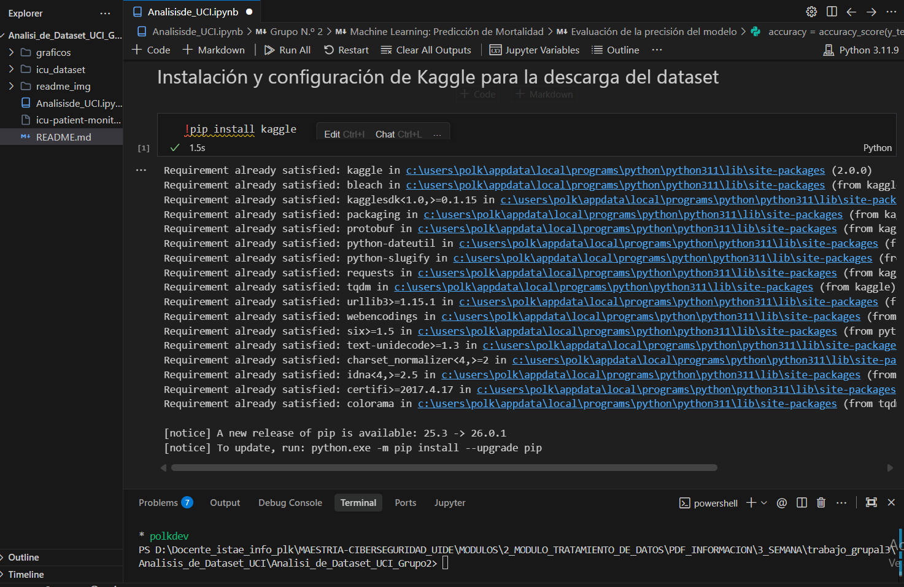

### Importación del Dataset

Se cargó el dataset principal para iniciar el análisis exploratorio y de limpieza.

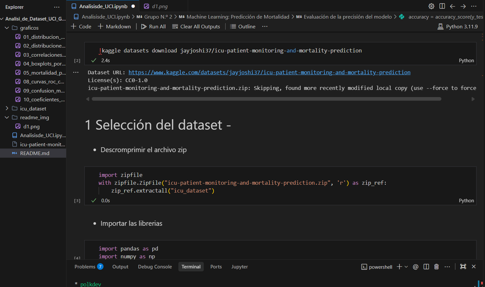

---

# 2. Explicación de los Pasos de Limpieza y Transformación

En esta etapa se realizó un **análisis detallado de la data**, seguido de un proceso de **limpieza y transformación**, con el objetivo de obtener un dataset **consistente, homogéneo y listo para modelado predictivo**.

Las principales acciones fueron:

1. **Importación de librerías necesarias**  

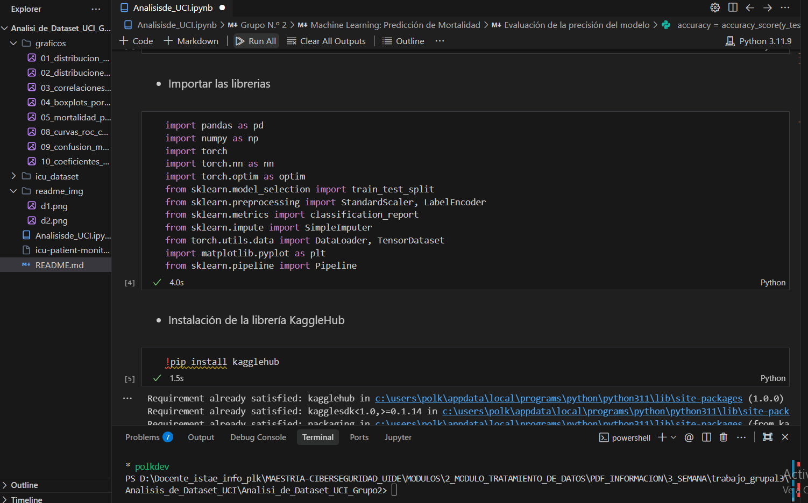

2. **Visualización inicial del dataset**  

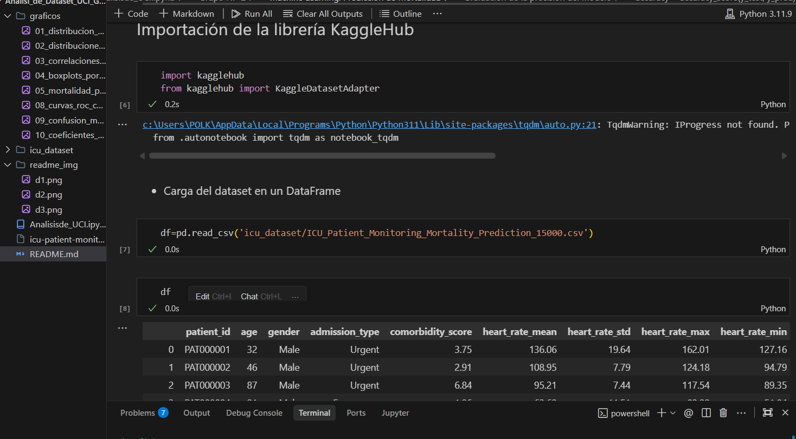

3. **Limpieza de datos basada en la variable principal**  

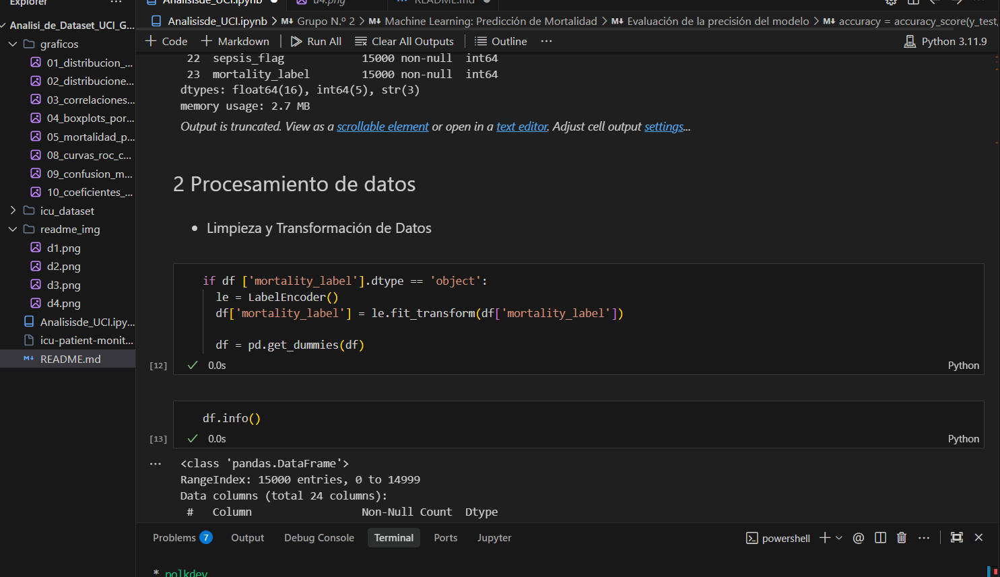

4. **Detección de valores nulos y manejo de datos faltantes**  

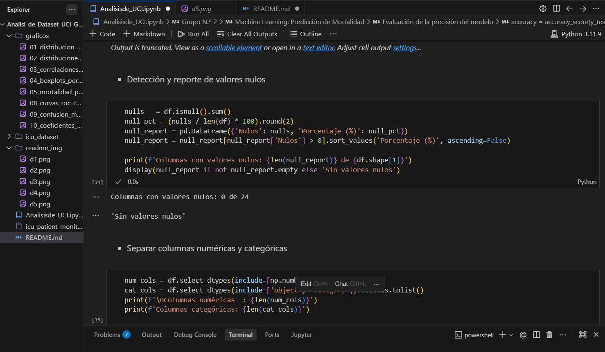

5. **Separación de columnas numéricas y categóricas**  

6. **Eliminación de registros duplicados**  

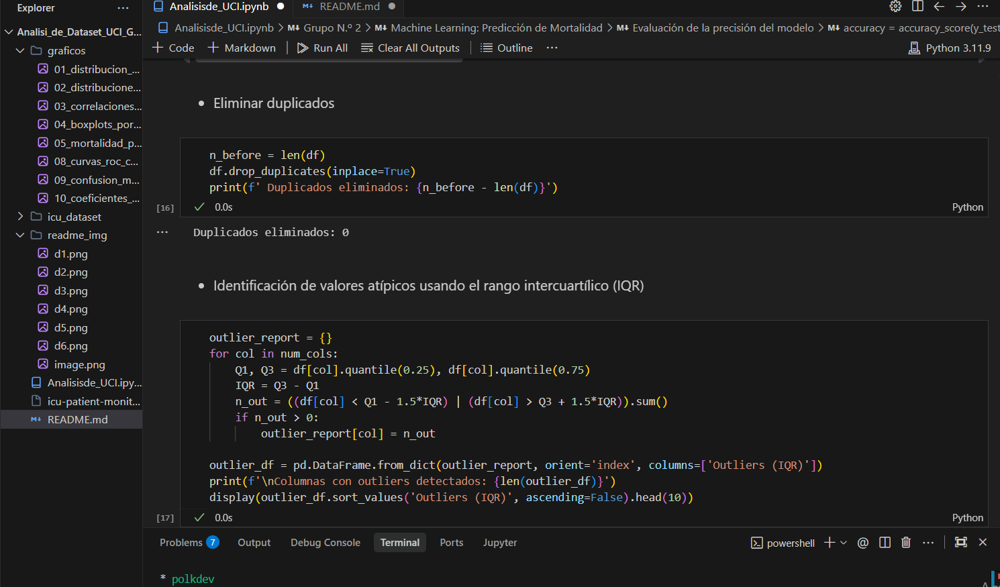

---

> Esta metodología asegura que los datos queden **preparados para análisis exploratorio avanzado** y la **implementación de modelos predictivos** de manera confiable.

# 3. Principales Hallazgos del Análisis

A continuación se presentan los hallazgos más relevantes obtenidos del análisis de los datos:

- **Tasa de mortalidad global:**  
  La tasa de mortalidad general del dataset es del **22.79%**, lo que indica que casi una cuarta parte de los pacientes monitoreados presentan un riesgo crítico.  

  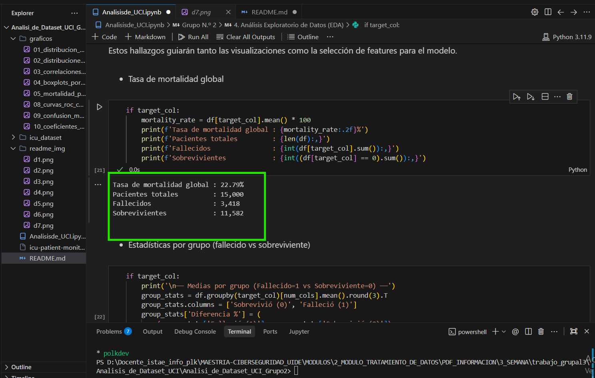

- **Supervivencia de los pacientes:**  
  Aunque la mayoría de los pacientes sobrevive, los datos muestran que una **parte significativa no logra sobrevivir**, lo que resalta la importancia de la monitorización y predicción temprana.  

  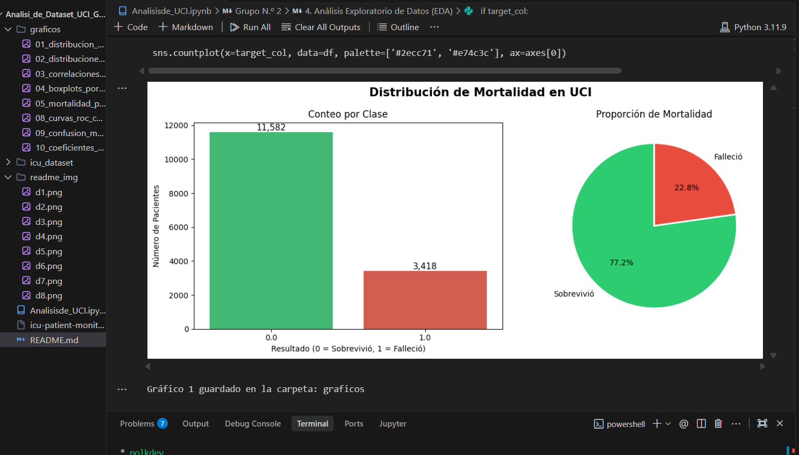

- **Mapa de correlaciones (heatmap):**  
  El mapa de calor evidencia la **independencia de varias variables**, un aspecto crucial para el entrenamiento de modelos predictivos, ya que reduce la redundancia y mejora la precisión de los algoritmos.  

  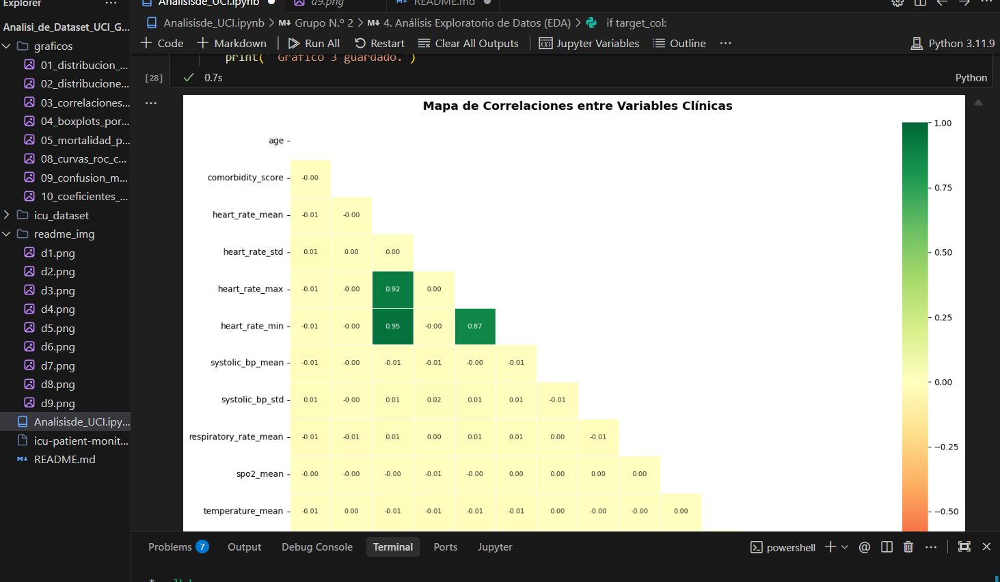

- **Mortalidad por género:**  
  La tasa de mortalidad es **similar entre ambos géneros**, lo que indica que, en casos de emergencia crítica, el género no tiene un impacto significativo en el riesgo de fallecimiento.  

  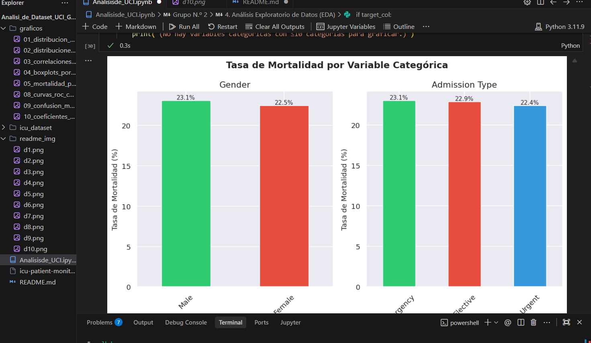

## 4 Cualquier insight o conclusión relevante

El dataset de **15,000 registros** presentó una **buena calidad general**:

- No se detectaron **duplicados significativos**.
- Los **valores nulos** fueron manejables mediante **imputación estadística**.

Sin embargo, el análisis reveló **señales consistentes de que los datos fueron generados sintéticamente**, evidenciado por tres hallazgos clave:

1. **Correlaciones entre variables clínicas prácticamente nulas:**  
   En todos los casos, las variables como edad, presión arterial y comorbilidades presentan correlaciones cercanas a cero. Esto es **inusual en pacientes reales de UCI**, donde estas variables suelen estar interrelacionadas.

2. **Uniformidad en mortalidad por género y tipo de admisión:**  
   Tanto el **género** como el **tipo de admisión** presentan tasas de mortalidad idénticas entre subgrupos (~23%), sin diferencias clínicamente esperables.

3. **Mortalidad similar en admisiones de emergencia y electivas:**  
   Las **admisiones de emergencia** no muestran mayor mortalidad que las **electivas**, lo cual **contradice la evidencia médica establecida** y resalta la naturaleza sintética del dataset.

> Estos hallazgos son importantes para contextualizar los resultados de los modelos predictivos y **considerar limitaciones al interpretar los insights** derivados de la data.

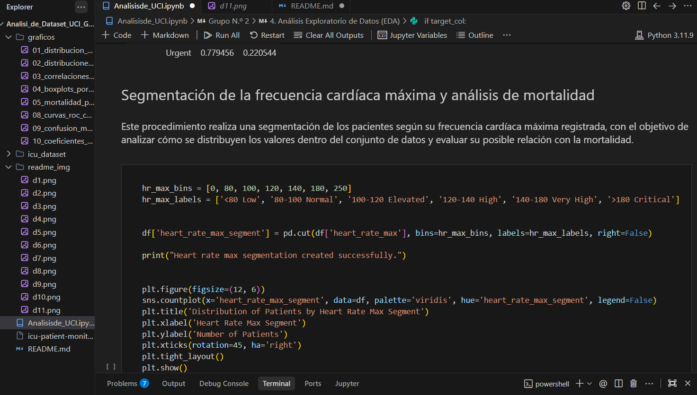

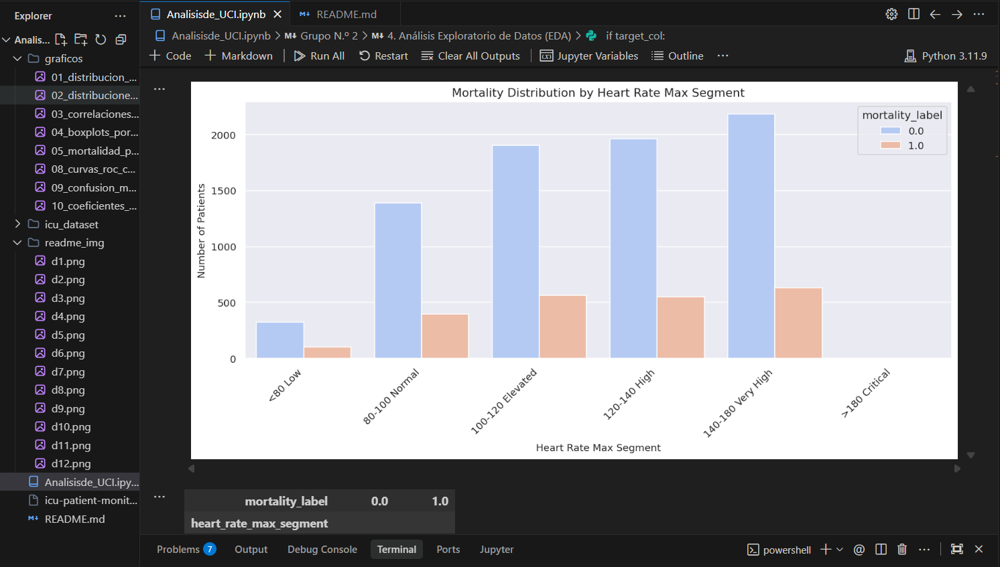